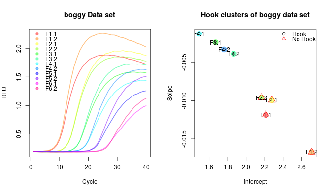

# Summary

Data having a characteristic sigmoid ('S'-shaped) curves are commonly found in 
experimental data. An example are amplification curve data from quantitative 
Polyerase Chain Reaction (qPCR) experiments. There are numerous software 
packages for R for the analysis of qPCR data 
[@pabinger_survey_2014, @rodiger_r_2015]. so far, there was no R package, which 
prepares amplification curve data or extracts curve features for machine 
learning. `PCRedux` provides tools for importing and working with sigmoid data.

The `PCRedux` package contains functions and data sets for machine learning and 
statistical analysis on sigmoid curve data. In detail, data sets of quantitative 
PCR data ware created and rated by human experts. In addition, classifications 
of all data sets from the `qpcR` package [@ritz_qpcr:_2008] are part of the 
`PCRedux` package.

Amplification curve characteristics such a the hook effect are challenging 
during the amplification curve classification. Features from amplification 
curves can be extract by the `pcrfit_parallel` function. `pcrfit_parallel` 
perfroms in parallel multiple analyis on the curve data such as changepoint 
analysis, regression analyis, model fitting to qPCR data. They are intended for 
the creation of models that predict a class (positive, ambigous, negative qPCR 
reaction) from input features (slope, hook effect, background level, 
changepoints) based on implementations by others (e.g., @erdman_bcp:_2007, 
@ritz_qpcr:_2008, @Febrero_Bande_2012, @james_ecp:_2013) and us (e.g., 
@roediger_RJ_2013, @rodiger_chippcr:_2015). qPCR amplification curves my 
exhibit hook effect [@barratt_improving_2002]. Besides previously proposed 
approaches offerst package the `hookreg` function was introduced to determine if 
an amplification curve exhibits this characteristics. 

<!-- -->

# Acknowlegements
This work was funded by the Federal Ministry of Education and Research
(BMBF) InnoProfile-Transfer-Projekt 03IPT611X and in part by 'digilog: Digitale
und analoge Begleiter für eine alternde Bevölkerung' (Gesundheitscampus
Brandenburg, Brandenburg Ministry for Science, Research and Culture).

\newpage

# References
