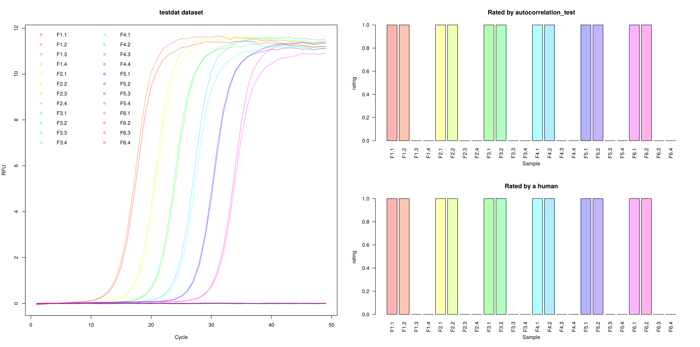

# Summary

There are numerous examples of data with a sigmoid ('S'-shaped) curves in diverse 
areas of science. One example is amplification curve data from quantitative 
Polymerase chain reactions (qPCR). The qPCR is an indispensable technology in human diagnostics and forensics [@martins_dna_2015]. 
There are software packages, which offer workflows and criteria to process the qPCR data. That includes the preprocessing of the raw data, the fitting of non-linear models on raw data, the calculation of quantification points, 
the computation of amplification efficiency, the relative gene expression 
analysis, normalization procedures and data management [@roediger2015chippcr, 
@spiess_impact_2015, @pabinger_2014, @roediger2015r, @roediger_enabling_2017, @mallona_chainy: _nodate]. However, there is no open source software package that contains classified data sets and provides biostatistical methods for machine learning on amplification curves. 

# Package and Functionalities

The `PCRedux` package contains functions and classified amplification curves for machine learning and statistical analysis. Each amplification curve was classified (negative, positive) by a human being. For curve shap based classification, the `tReem()` funftion was developed.
To analyze the amplification curves methods such as change-point analysis, regression analysis, autocorrelation analysis and model fitting have been integrated based on the implementations of others and us (e. g. @erdman_bcp: _2007, 
@Ritz2008, @Febrero_Bande_2012, @james_ecp: _2013) and us [@roediger_RJ_2013, 
@roediger2015chippcr] the `pcrfit_single ()` function calculate more than 45 features from the amplification curves. This is useful for creating models and predicting classes (e. g. negative, positive). We have integrated the visualization function `visdat_pcrfit ()` for data management, inspired by @Tierney2017. Additional functionality in the package includes:

- `autocorrelation_test()`, which performs an autocorrelation analysis on amplification cures,
- `decision_modus()`, which calculates the frequency of classes in a data set,
- `earlyreg()`, which calculates features by a regression analysis in the background region,
- `head2tailratio()`, which compares the ratio of the head and tail,
- `hookregNL()` and `hookreg()`, which attempt to detect a hook effect in the amplification curve,
- `mblrr()`, which performs local robust regressions analysis,
- `performeR()`, which performance analysis (e.g., sensitivity, specificity, Cohen's kappa) for binary classification,
- `qPCR2fdata()`, which is helper function to convert amplification curve data to the *fdata* format,
- `encu()`, which enables high-throughput data processing.

The `PCRedux` can be used for the extraction of features and for machine learning on amplification curves. The `PCRedux` package is an add-on package for open source statistical computing language and environment *R* [@R_language].

<!-- -->

# Acknowledgements
This work was funded by the Federal Ministry of Education and Research
(BMBF) InnoProfile-Transfer-Projekt 03IPT611X and in part by 'digilog: Digitale
und analoge Begleiter für eine alternde Bevölkerung' (Gesundheitscampus
Brandenburg, Brandenburg Ministry for Science, Research and Culture).

Corresponding Author: stefan.roediger@b-tu.de

\newpage

# References
